## SFTP Server Setup & Hardening

### OVERVIEW

In this project, I configured an Ubuntu Server machine as a secure SFTP server. I implemented SSH hardening, restricted SFTP user environments using ``chroot``, and created a custom SFTP user activity log file.

---

#### SSH Hardening

Edit the ``sshd`` configuration file 
- OpenSSH daemon (``sshd``) is a background process in Linux that listens for incoming SSH connections from clients.
- ``sshd`` can be configured using **command-line options** or the ``/etc/ssh/sshd_config`` configuration file, which defines the SSH behavior on the server

Run the following command:
``` bash
sudo nano /etc/ssh/sshd_config
```
In the nano text editor, locate and edit the following **key/value** pairs (uncomment lines if needed):
```bash
Port 2201
PermitRootLogin no
MaxAuthTries 5
PubkeyAuthentication yes
UsePAM yes
```
- Explanation:
    - ``Port [number]`` → Defines which **TCP** port the OpenSSH daemon listens on
    - ``PermitRootLogin no`` → **Prohibits** the ``root`` user from logging in directly **via SSH**
    - ``MaxAuthTries [number]`` → The **number of authentication attempts** per connection before termination
    - ``Pubkey Authentication yes`` → Enables login via **SSH keys**
    - ``UsePAM yes`` → Manages **system-wide authentication** (passwords, tokens, etc.)

Save your configurations and exit the nano text editor.

In order for our new configurations to take effect, we need to restart the **SSH service** using systemd's ``systemctl`` command:
```bash
sudo systemctl restart ssh
```

- **Systemd** is the system and service manager for modern Linux distributions. It controls how system processes (daemons) start, stop, and interact with one another.

Verify that the SSH service is active:
```bash
sudo systemctl status ssh
```
The output should say ***active (running)*** and ***enabled***
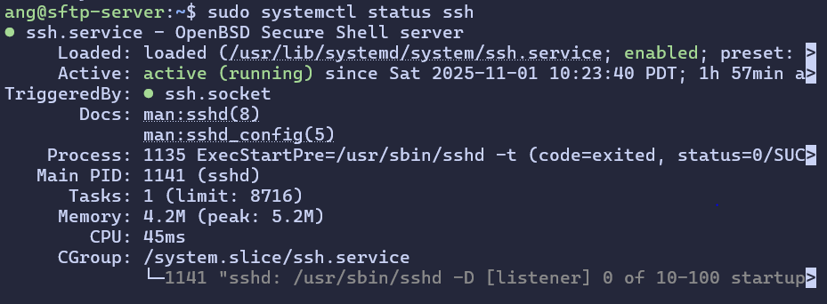

Next, confirm that ``sshd`` is listening on the custom port:
```bash
sudo ss -tlnp | grep ssh
```
- Command breakdown:
    - ``ss`` → Displays **socket statistics** (network connections). 
    - ``t`` → Displays **TCP sockets**
    - ``l`` → Displays only **listening** sockets
    - ``n`` → Displays **numeric** addresses instead of hostnames
    - ``p`` → Shows **process names** using sockets
    - ``| grep ssh`` → Filters results to only show SSH processes

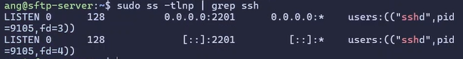

On your client machine, confirm that the server is only accessible using the **new custom port**.

A normal SSH connection command should **fail**:
```PowerShell
ssh username@server
```


To connect using a custom port, use the ``-p`` flag:
```PowerShell
ssh -p [portnumber] username@server
```
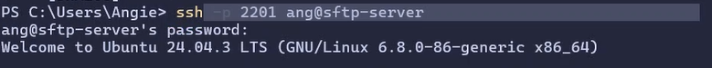

Confirm that direct ``root`` login is **denied**, even with the correct password:
```PowerShell
ssh -p [portnumber] root@server
```
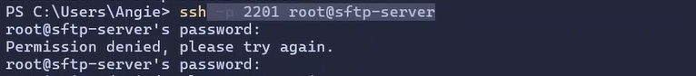

Create an **SSH key pair** to authenticate with:
```PowerShell
ssh-keygen.exe -t rsa -b 4096 -f $env:USERPROFILE\.ssh\id_rsa
```
- Command breakdown:
    - ``ssh-keygen.exe`` → Generates a new **public/private** SSH key pair
    - ``-t rsa`` → Specifies the **encryption algorithm** (RSA)
    - ``-b 4096`` → sets **key length** in bits (4096)
    - ``-f $env:USERPROFILE\.ssh\id_rsa`` → Specifies the output file **location for the key pair**  
   
- It’s best practice to generate SSH keys on the **client machine** to ensure the private key never leaves the local system

Go to the file location of your **PUBLIC** key (``id_rsa.pub``) and copy the file content:
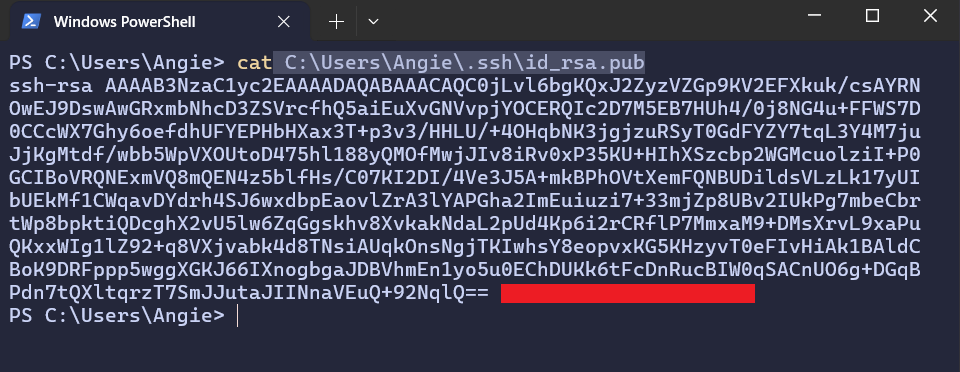

On the SFTP server, paste the public key into your ``authorized_keys`` file: 
```bash 
sudo nano ~/.ssh/authorized_keys
```

On your client machine, verify **key-based authentication** is working: 
```PowerShell
ssh -i ~/.ssh/id_rsa -p [portnumber] username@server
```
- Explanation:
    - ``-i ~/.ssh/id_rsa`` → Specifies the **client’s private key file** to use for authentication

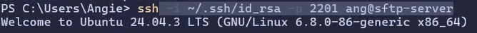

Once you’ve confirmed key-based login works, **disable password-based SSH access** entirely:
``` bash
sudo nano /etc/ssh/sshd_config
```

Update or add the following line:
``` bash
PasswordAuthentication no
```

Restart and verify the SSH service:
```bash
sudo systemctl restart ssh
sudo systemctl status ssh
```

At this point, SSH access to your server **requires an authorized key pair**, and password-based logins are no longer accepted.

---

#### SFTP Chroot Users

To **restrict SFTP users** to their own directories, we’ll create separate accounts and use the ``chroot`` mechanism to limit their file system access.
- My scenario users will be ``matt`` and ``ray``

Create the user accounts and directories:
```bash 
for u in matt ray; do
    sudo useradd -m -d /home/"$u" "$u"
    sudo passwd "$u"
    sudo mkdir /home/"$u"/files
    sudo chown root:root /home/"$u"
    sudo chmod 755 /home/"$u"
    sudo chown "$u":"$u" /home/"$u"/files
    sudo chmod 755 /home/"$u"/files
done
```
- Command breakdown:
    - ``useradd -m -d`` → Creates a user with a **home directory**.
    - ``passwd`` → Sets the user’s password.
    - ``mkdir /home/"$u"/files`` → Creates a **working directory** for file uploads/downloads.
    - ``chown root:root /home/"$u"`` → The user’s root directory must be **owned by root** for chroot to function securely.
    - ``chmod 755 /home/"$u"`` → Allows proper **read/execute permissions**.
    - ``chown "$u":"$u" /home/"$u"/files`` → Gives the **user ownership** of their files directory.
    - ``chmod 755 /home/"$u"/files`` → Allows **read/write access** within their contained environment.

Verify the users were added **successfully**:
```bash
sudo grep -E "(user1|user2)" /etc/passwd
```
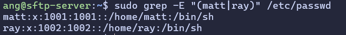

Next, configure the SSH daemon to use **internal SFTP** and **chrooted environments**:
```bash
sudo nano /etc/ssh/sshd_config
```
Add or modify the following lines:
```bash
Subsystem sftp internal-sftp
LogLevel VERBOSE

Match User matt
    ChrootDirectory /home/matt
    ForceCommand internal-sftp -d /files
    AllowTcpForwarding no
    X11Forwarding no
    PasswordAuthentication yes

Match User ray
    ChrootDirectory /home/ray
    ForceCommand internal-sftp -d /files
    AllowTcpForwarding no
    X11Forwarding no
    PasswordAuthentication yes
```
- Explanation:
    - ``Subsystem sftp internal-sftp`` → Enables SFTP as a **subsystem** handled directly by the SSH daemon.
    - ``ChrootDirectory`` → **Locks** the user into a **restricted** directory tree.
    - ``ForceCommand internal-sftp -d /files`` → Ensures users can **only use SFTP** and start in their files directory.
    - ``AllowTcpForwarding`` and ``X11Forwarding`` → are **disabled** for security.
    - ``PasswordAuthentication yes`` → Gives explicit permission for SFTP users to use **passwords for authentication** 

Restart SSH to apply the changes:
```bash
sudo systemctl restart ssh
```

On your client machine, connect to the server via SFTP. Specify the custom port using the ``-P`` flag:
```PowerShell
sftp -P [portnumber] sftpuser@server
```
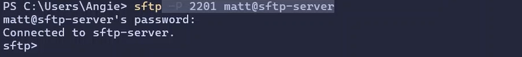

Confirm users **cannot access** the server using SSH:
```Powershell
ssh -p [portnumber] sftpuser@server
```


---

#### Fail2Ban

Fail2Ban helps protect the server from **brute-force attacks** by monitoring log files for repeated failed login attempts and automatically banning the offending IPs.

Install Fail2Ban using ``apt install``:
```bash
sudo apt install fail2ban
```

Create a custom Fail2Ban configuration file:
- Creating a new config file lets us make **custom configurations**, without losing our default ones. This makes it easier to revert back original settings if needed.
```bash
sudo nano /etc/fail2ban/jail.local
``` 
Enter the following in the nano text editor:
```bash
[DEFAULT]
bantime = 24h
maxretry = 3

[sshd]
enabled = true
port = 2201
logpath = /var/log/auth.log
banaction = ufw
```

- Command breakdown:
    - ``bantime = 24h`` → The **duration an IP is banned** after reaching the retry limit.
    - ``maxretry = 3`` → The **number of failed login attempts** before a ban occurs 
    - ``enabled = True`` → Activates the **SSH jail**
    - ``port = [portnumber]`` → Matches the **custom SSH port** configured earlier 
    - `` logpath`` → Points to the **authentication log** Fail2Ban monitors 
    - ``banaction = ufw`` → Uses **UFW** (Uncomplicated Firewall) to **block** offending IPs.

Enable and configure the UFW firewall:
```bash
sudo systemctl enable ufw
sudo ufw enable
sudo ufw allow 2201/tcp
sudo systemctl restart ufw
```
Enable and start Fail2Ban:
```bash
sudo systemctl enable fail2ban
sudo systemctl restart fail2ban
```
- In this set up, Fail2ban monitors the log file ``/var/log/auth.log`` for too many **failed login attempts**. When a client exceeds the ``maxretry`` threshold, UFW takes over and **blocks** that client's IP. 

Verify Fail2Ban status:
```bash 
sudo systemctl status fail2ban
```
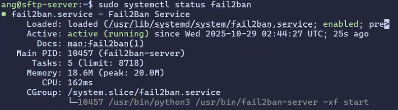

You can attempt **incorrect login attempts** for one of the SFTP users to trigger Fail2Ban:
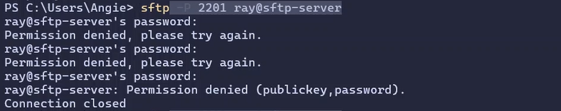

Verify that the SSH jail is **active** and monitoring banned IPs:
```bash
sudo fail2ban-client status
sudo fail2ban-client status sshd
```


- This confirms Fail2ban is **running** and **protecting** SSH from repeated unauthorized login attempts

---

#### Custom Logging File

To monitor SFTP user **login** and **logout** activity, we'll create a **dedicated log file** with related entries using Rsyslog.

- **Rsyslog** is the system’s main **logging service**, it collects and manages log messages from different programs and services. In this setup, we configure a custom log file that **tracks SFTP activity** for specific users.

Create the log directory and file:
```bash
sudo mkdir -p /var/log/sftp
sudo touch /var/log/sftp/sftp_activity.log
sudo chmod 640 /var/log/sftp/sftp_activity.log
sudo chown syslog:adm /var/log/sftp/sftp_activity.log
```
- Command breakdown:
    - ``mkdir -p`` → Creates the **directory** (and parent directories if needed).
    - ``touch`` → Creates an **empty log file**.
    - ``chmod 640`` → Grants **read/write** access to the owner and read access to the group.
    - ``chown syslog:adm`` → Gives **ownership** to the system logging service.

Configure Rsyslog to filter and store SFTP logs for **specific users**:
```bash
sudo nano /etc/rsyslog.d/30-sftp.conf
```
Enter the following in the nano text editor:
```bash 
if ($programname == 'sshd' and ($msg contains 'matt' or $msg contains 'ray')) then /var/log/sftp/sftp_activity.log
& stop
```
- Explanation:
    - ``$programname == 'sshd'`` → Matches log messages **generated by ``sshd``**.
    - ``$msg contains 'matt' or $msg contains 'ray'`` → Filters messages that **include the usernames “matt” or “ray”**
    - ``then /var/log/sftp/sftp_activity.log`` → Sends the log entries to the **custom file**.
    - ``& stop`` → **Prevents duplicate logging** by stopping further rule processing.

Finally, set the correct **timezone** and verify time settings for **accurate log timestamps**:
```bash
sudo timedatectl set-timezone America/Los_Angeles
timedatectl
```

Restart Rsyslog to apply configuration changes:
```bash 
sudo systemctl restart rsyslog
```

SFTP activity for the specified users will now be logged to:
```bash
/var/log/sftp/sftp_activity.log
```
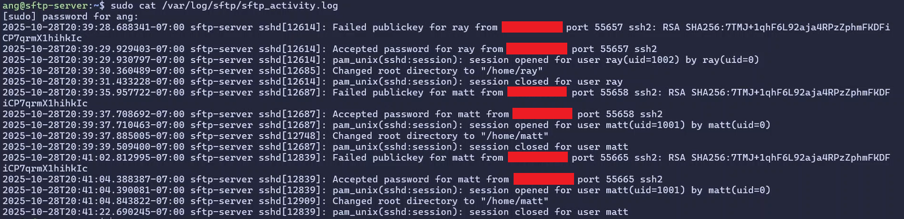
